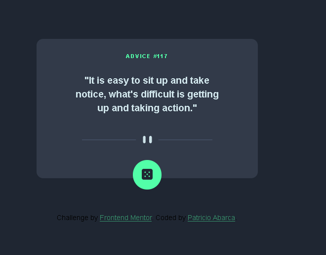

# Frontend Mentor - Advice generator app solution

This is a solution to the [Advice generator app challenge on Frontend Mentor](https://www.frontendmentor.io/challenges/advice-generator-app-QdUG-13db). Frontend Mentor challenges help you improve your coding skills by building realistic projects.

## Table of contents

- [Overview](#overview)
  - [The challenge](#the-challenge)
  - [Screenshot](#screenshot)
  - [Links](#links)
- [My process](#my-process)
  - [Built with](#built-with)
  - [What I learned](#what-i-learned)
  - [Useful resources](#useful-resources)
- [Author](#author)

**Note: Delete this note and update the table of contents based on what sections you keep.**

## Overview

### The challenge

Users should be able to:

- View the optimal layout for the app depending on their device's screen size
- See hover states for all interactive elements on the page
- Generate a new piece of advice by clicking the dice icon

### Screenshot

### Links

- Solution URL: [Add solution URL here](https://your-solution-url.com)
- Live Site URL: [Add live site URL here](https://your-live-site-url.com)

## My process

### Built with

- Semantic HTML5 markup
- CSS custom properties
- Flexbox
- Mobile-first workflow
- JS
- Fetch
- API

### What I learned

In this exercise I learned how to make a simple fetch request. In addition, to know the Cache-Control property to control the storage.

### Useful resources

- [Example resource 1](https://developer.mozilla.org/en-US/docs/Web/HTTP/Headers/Cache-Control) - This helped me to know the name of the control-cache property in feth and in xmlHttpRequest object

## Author

- FrontedMentor - [Patosinsuerte](https://www.frontendmentor.io/profile/Patosinsuerte)
- Github - [@pabarcag](https://github.com/pabarcag)

